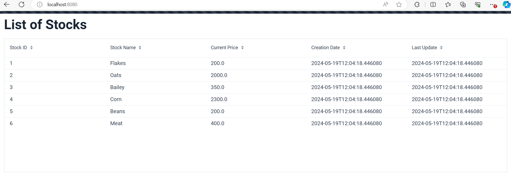

# Bare Application

This is a Spring Boot application that uses Vaadin for the UI and Spring Data JPA for persistence. It provides a list of stocks that are stored in a MySQL database.

## Prerequisites

- Java 21
- Maven
- MySQL
- Vaadin

## Running the Application

1. Clone the repository: `git clone https://github.com/bitscoder-dotcom/bare.git`
2. Navigate to the project directory: `cd bare`
3. Build the project: `mvn clean install`
4. Run the application: `mvn spring-boot:run`

The application will be accessible at `http://localhost:8080/`.

## API Documentation

You can view the API documentation and test the endpoints using Postman. 
The documentation is available at this link: https://documenter.getpostman.com/view/25585012/2sA3QmCuJt

The available endpoints are:

- `POST /api/stocks`: Create a new stock.
- `GET /api/stocks/{stockId}`: Get a stock by its ID.
- `PUT /api/stocks/{stockId}`: Update the price of a stock.

You can test these endpoints using Postman.

## Viewing the List of Stocks

To view the list of stocks, navigate to `http://localhost:8080/` in your web browser. The list of stocks will be displayed in a table.

## Contributing

Please read `CONTRIBUTING.md` for details on our code of conduct, and the process for submitting pull requests to us.

## License

This project is licensed under the MIT License - see the `LICENSE.md` file for details

# Images

